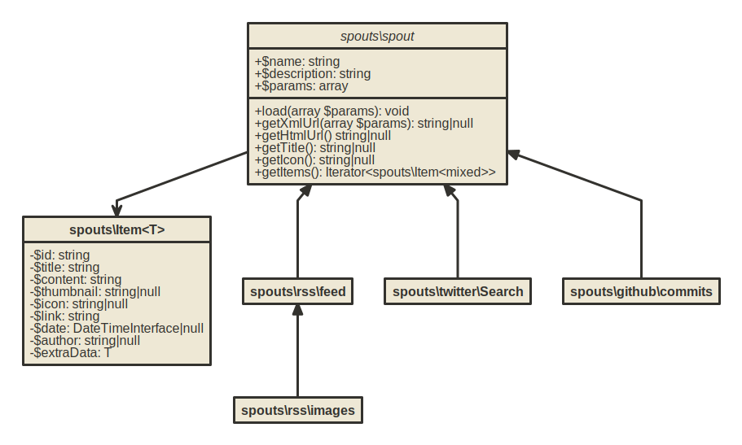

+++
title = "Creating spouts"
weight = 20
+++

You can easily add your own data sources. Spouts (aka plug-ins) fetch the content from the different sources. Some spouts are included:

* RSS Feeds
* Images from a RSS Feed
* Images from deviantArt Users
* Images from tumblr
* Your twitter timeline
* Tweets of a twitter user
* heise News with full content
* golem News with full content
* MMOSpy News with full content

If you want to get the newest entries from your own source (e.g. an IMAP e-mail Account, Log Files or any data from your own application), you can include a new spout in your selfoss stream by writing just one PHP class (saved in a single PHP file).

Create a new PHP file under `src/spouts/your_spouts/your_spout.php` (choose a name for `your_spouts` and `your_spout`). The easiest way is to copy the [`src/spouts/rss/feed.php`](https://github.com/fossar/selfoss/blob/master/src/spouts/rss/feed.php) and to modify this file.

<div class="admonition warning">

## Warning

The following documentation targets the upcoming selfoss 2.20. You can read about the changes in [NEWS](https://github.com/fossar/selfoss/blob/master/NEWS.md#customization-changes).

</div>

### Member Variables
Set the `$name` and `$description` variable with the name and description of your spout. The `$params` contain the definition of the input fields which a user will have to fill to add a new source of your spout (e.g. `username` and `password` for accessing the source data).

A simple example for the member variables of a spout for accessing an e-mail inbox via IMAP:

```php
<?php

namespace spouts\Mail;

use spouts\Parameter;

class Imap extends \spouts\spout {
    public string $name = 'E-mail';
    public string $description = 'Obtain e-mails from IMAP account';
    public array $params = [
        'email' => [
            'title'      => 'E-mail',
            'type'       => Parameter::TYPE_TEXT,
            'default'    => '',
            'required'   => true,
            'validation' => [Parameter::VALIDATION_EMAIL]
        ],
        'password' => [
            'title'      => 'Password',
            'type'       => Parameter::TYPE_PASSWORD,
            'default'    => '',
            'required'   => true,
            'validation' => [Parameter::VALIDATION_NONEMPTY]
        ],
        'host' => [
            'title'      => 'URL',
            'type'       => Parameter::TYPE_TEXT,
            'default'    => '',
            'required'   => true,
            'validation' => [Parameter::VALIDATION_NONEMPTY]
        ]
    ];
}
```

### Methods

Your source will have to implement a few methods. Following UML diagram shows the inheritance structure:



The class has to implement three things:

* `load(array $params): void` method, which will be executed by selfoss when the content of the source is to be updated. The method has a single array parameter `$params`, which contains values for the parameters defined in spout’s `$params` property specified by user. It should contains a code that fetches the data (e.g. loading the emails from an IMAP email account).
* `getHtmlUrl(): string|null` method that should return the web-accessible URL corresponding to the source.
* `getItems(): Iterator<Item>` method returning an [`Iterator`](https://www.php.net/manual/en/class.iterator.php) with the individual entries obtained in the `load()` method (e.g. the emails which were fetched by the load function). Instead of manually creating an `Iterator`, you can also “return” items using the `yield` operator and PHP will return [generator](https://www.php.net/manual/en/language.generators.overview.php) for you.

### Thumbnails

If you would like to show thumbnails instead of text, set the `thumbnail` field of `Item` to a URL of the image. selfoss will load and generate the thumbnail automatically. See [`src/spouts/rss/images.php`](https://github.com/fossar/selfoss/blob/master/src/spouts/rss/images.php) for an example. This spout searches for an image in an RSS feed and returns it.

### Your Spouts

Feel free to send us your own spouts. We are really happy about new sources we can add to further versions of selfoss. You can send them by email to [tobias.zeising@aditu.de](mailto:tobias.zeising@aditu.de) or as a pull request to the [GitHub repository](https://github.com/fossar/selfoss).
